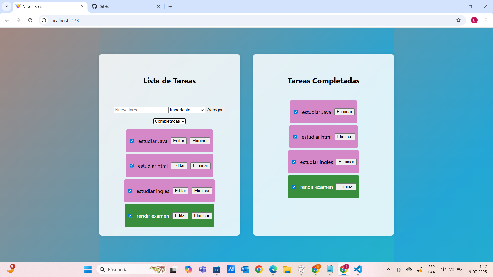
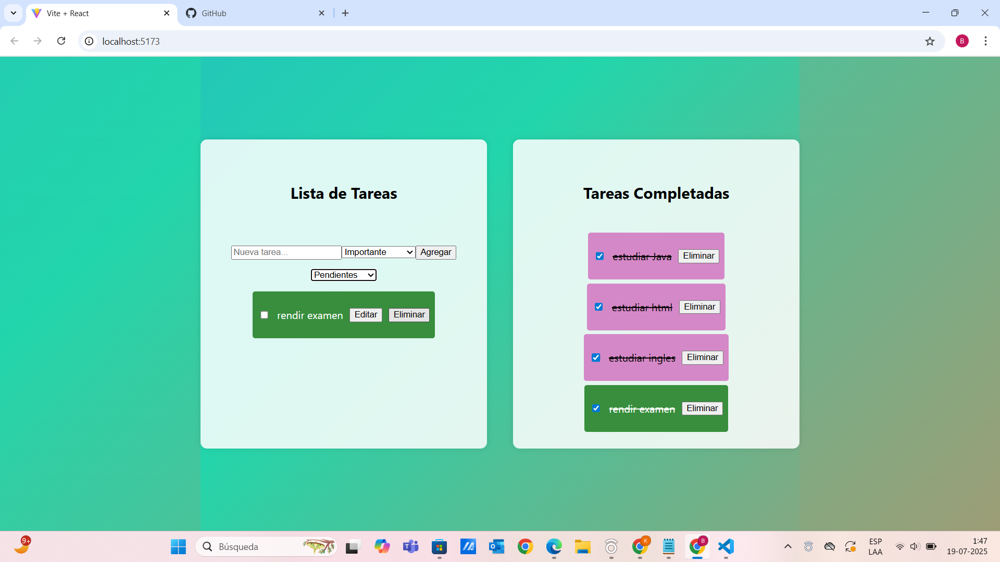

# Aplicación en React

Aplicación de lista de tareas desarrollada con React. ayuda agregar, marcar como completada la tarea, editar y eliminar tareas, tambien se usa localStorage.

Dato: 
  - Muy importante: verde
  - Importante: rosado

Aqui podemos revisar, estan las tareas, distinguidas por color, ya que en rosado son tareas importantes, y en verde muy importantes, una vez completada la tarea ingresa a la seccion"Tarea completa"

Aqui podemos ver que tambien se pueden filtrar por "pendientes" "completadas"

